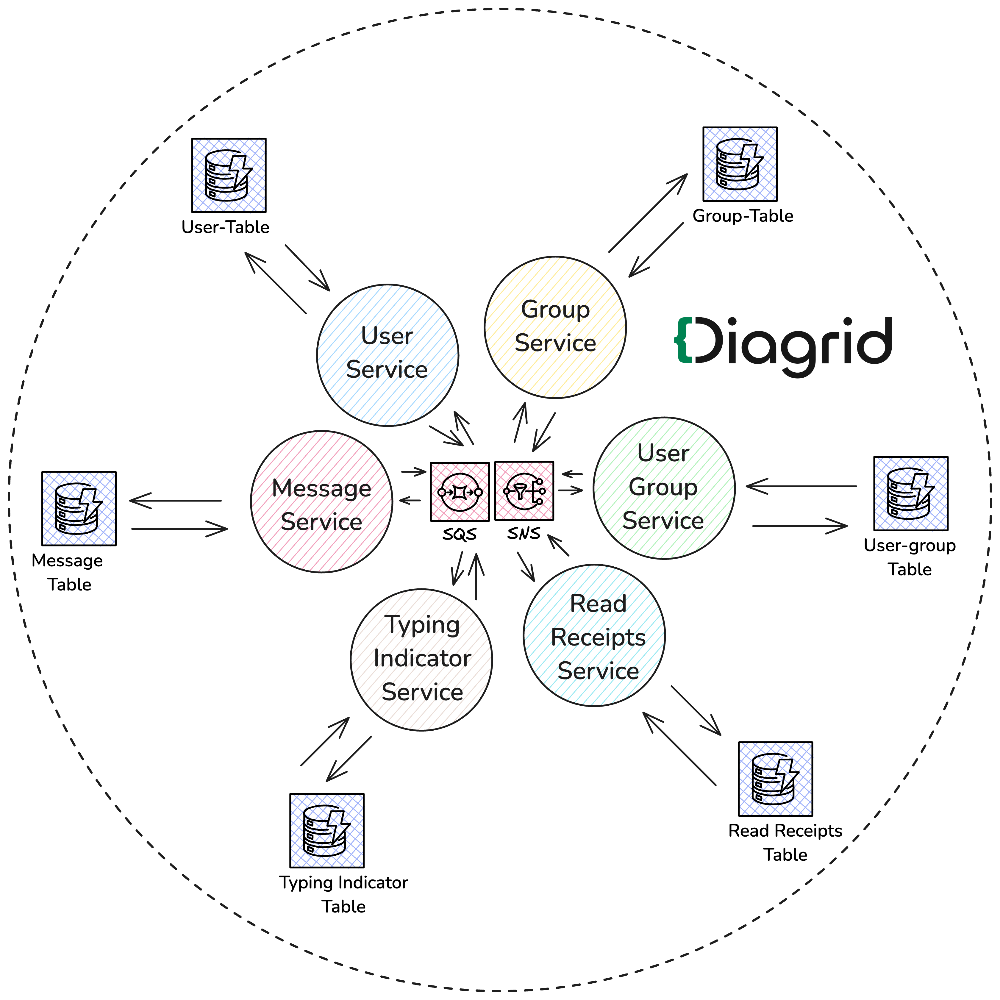
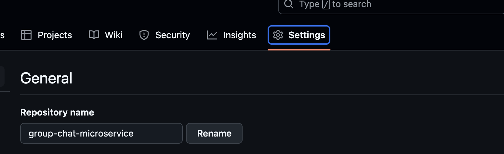
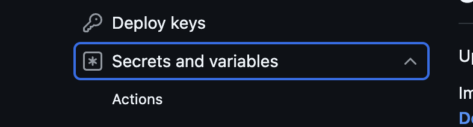
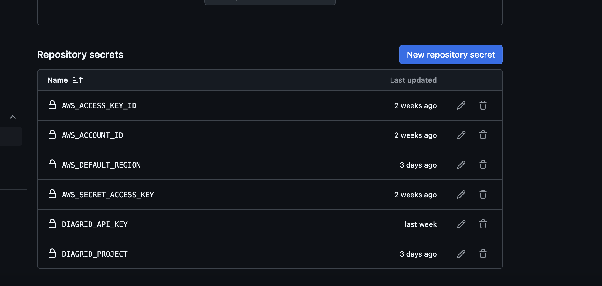

# Create Diagrid(Catalyst) Project And Components

Because this project has 6 services, each of these services will represent a
Catalyst App Id.

Communication between services will be done through a pubsub connection that
consist of SNS topics and SQS subscriptions. AWS SNS/SQS will be configured on
demand by Catalyst.

Each service will have a state for data storage and for this application, we'll
be using AWS DynamoDB.



There's a Github Actions pipeline setup to automate the creation and
configuration of this project, alongside all it's components.

Create a fork of this github repository[INSERT_GITHUB_REPOSITORY_HERE].

Navigate to the `Settings` menu of your fork. 

Scroll down to the bottom left hand side of the screen and click on
`Secrets and Variables`.



Click on `Actions`.

.

Click on the blue button `New repository secret` and add key-value pairs for
each of these repository secrets.

Assuming you created an AWS Access Key/secret in the prerequisite section.

For the Diagrid API_KEY, assuming you've installed and logged into the diagrid
CLI from the command line, run this command

```bash

diagrid apikey create --name [ENTER NAME OF API KEY] --role  cra.diagrid:admin

```

Replace `[ENTER NAME OF API KEY]` with any name of your choice.

For the `DIAGRID_PROJECT` , use this `group-chat-microservices`

- AWS_ACCESS_KEY_ID
- AWS_ACCOUNT_ID
- AWS_DEFAULT_REGION
- AWS_SECRET_ACCESS_KEY
- DIAGRID_API_KEY
- DIAGRID_PROJECT

Clone your fork and open it with any IDE of your choice. Navigate to the
`.github/workflows` folder and you'll find a pipeline with 3 jobs.

The first job creates and configures a diagrid catalyst project.

The second job deploys each catalyst App to ECS/FARGATE, generates endpoints
using the Application Load Balancer and then sets up these endpoints as public
endpoints in your catalyst Apps. Corresponding code is inside the `cdk-infra`
directory.

The third job creates a realtime Appsync API as a single point of entry into
your application, using each generated endpoint as an http
datasource.Corresponding code is inside the `cdk-graphql-stack` directory.

## Running Locally

Once cloned and open inside the IDE, run the command `python run.py` ... to be
continued
